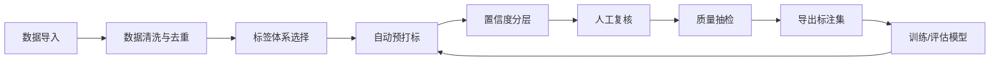
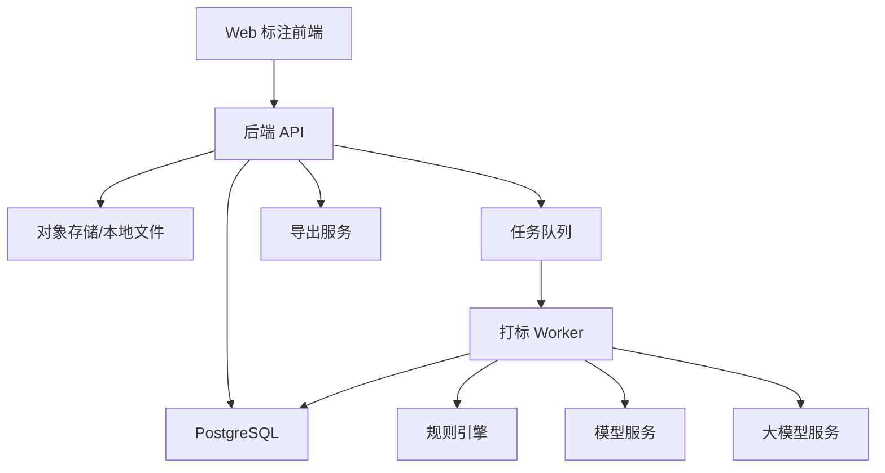

# 自动打标工具设计

## 1. 目标

设计一个“模型预打标 + 人工复核 + 质量闭环”的自动打标工具，优先解决以下问题：

- 批量数据无法完全人工标注，成本高、速度慢。
- 纯模型打标结果不稳定，缺少置信度、抽检、回滚和质量评估。
- 标注标准容易漂移，缺少版本化标签体系和审计记录。
- 后续训练数据难以追踪来源、模型版本和人工修正历史。

第一版定位为半自动打标平台：模型负责生成候选标签，人工负责确认、修改、拒绝；系统负责记录、评估和持续优化。

## 2. 适用场景

MVP 建议先选择一种主要数据类型落地：

- 文本：分类、实体抽取、关键词、风险标签、意图标签。
- 图片：分类、检测框、分割掩码、属性标签。
- 视频：帧级事件、片段标签、目标轨迹。
- 表格或业务记录：规则标签、风险分、异常原因。

如果当前业务还未固定数据类型，建议第一版先支持“文本/图片的通用分类标签”，因为它最容易形成完整闭环。

## 3. 核心流程



### 3.1 数据导入

支持 CSV、JSONL、文件夹、数据库任务四类入口。

每条样本进入系统后生成稳定 `sample_id`，并记录：

- 原始数据位置。
- 数据摘要或文件哈希。
- 数据来源批次。
- 导入人和导入时间。
- 当前标注状态。

### 3.2 标签体系

标签体系必须版本化，避免同一标签名在不同阶段含义不一致。

建议字段：

- `label_set_id`
- `version`
- `label_name`
- `description`
- `positive_examples`
- `negative_examples`
- `priority`
- `mutually_exclusive_group`

对于业务标签，必须提供正例、反例和边界案例。模型预打标和人工复核都使用同一份标签定义。

### 3.3 自动预打标

自动打标引擎分三层：

1. 规则层：关键词、正则、阈值、业务规则。
2. 模型层：传统模型、深度学习模型、视觉模型或大模型。
3. 融合层：把多个候选结果合并成最终建议，并给出置信度和理由。

输出不直接变成最终标签，而是生成 `prediction`：

```json
{
  "sample_id": "s_001",
  "label": "需要人工跟进",
  "confidence": 0.86,
  "source": "model:v1.3.2",
  "rationale": "命中了投诉相关表达，并且历史模型判断为高风险",
  "status": "pending_review"
}
```

### 3.4 置信度分层

按置信度把任务分成不同处理策略：

- 高置信度：少量抽检，通过后批量确认。
- 中置信度：进入人工复核队列。
- 低置信度：优先人工处理，并作为后续模型改进样本。
- 冲突样本：多个模型或规则结果不一致，进入专家复核。

默认建议：

- `confidence >= 0.90`：自动确认候选标签，但抽检 5%-10%。
- `0.60 <= confidence < 0.90`：人工复核。
- `confidence < 0.60`：人工优先标注。
- 多标签冲突：人工或专家复核。

阈值不要写死，应该按项目、标签、模型版本配置。

## 4. 用户角色

- 管理员：创建项目、标签体系、模型配置、导出任务。
- 标注员：复核模型预打标结果，修改或确认标签。
- 质检员：抽检已完成样本，退回低质量标注。
- 算法/数据工程师：接入模型，分析错误样本，重新训练。
- 业务专家：维护标签定义，处理边界样本。

## 5. 页面设计

### 5.1 项目列表

展示项目状态：

- 样本总数。
- 已预打标数量。
- 待复核数量。
- 已完成数量。
- 质检通过率。
- 当前模型版本。

### 5.2 数据导入页

能力：

- 上传 CSV/JSONL 或选择文件夹。
- 预览前 20 条样本。
- 选择标签体系。
- 配置去重字段。
- 创建导入批次。

### 5.3 标注工作台

核心页面，建议布局：

- 左侧：待处理队列和筛选条件。
- 中间：样本内容。
- 右侧：模型建议、置信度、解释、标签选择器。
- 底部：确认、修改、拒绝、跳过、送专家复核。

必须支持快捷键，但不要只依赖快捷键。

### 5.4 质检页

能力：

- 按标注员、标签、批次、置信度抽检。
- 标记通过、错误、争议。
- 错误样本退回复核。
- 输出质检统计。

### 5.5 分析页

关键指标：

- 自动标签覆盖率。
- 人工修改率。
- 标签分布。
- 每个标签的通过率。
- 模型版本对比。
- 低置信度样本占比。
- 常见错误类型。

## 6. 数据模型

### 6.1 Project

```text
id
name
description
data_type
label_set_id
created_by
created_at
status
```

### 6.2 Sample

```text
id
project_id
batch_id
content_uri
content_preview
content_hash
metadata_json
status
created_at
updated_at
```

### 6.3 Prediction

```text
id
sample_id
model_id
label_id
confidence
rationale
raw_output_json
created_at
```

### 6.4 Annotation

```text
id
sample_id
label_id
source
annotator_id
prediction_id
status
comment
created_at
updated_at
```

`source` 可取：

- `auto`
- `human`
- `corrected`
- `qc_rejected`

### 6.5 AuditLog

```text
id
entity_type
entity_id
action
before_json
after_json
user_id
created_at
```

## 7. 技术架构



### 推荐技术栈

如果从零开始：

- 前端：React + TypeScript + Vite。
- 后端：FastAPI + Python。
- 数据库：PostgreSQL，MVP 可先用 SQLite。
- 队列：Celery/RQ，MVP 可先用 FastAPI BackgroundTasks。
- 文件存储：本地目录，后续接 MinIO/S3。
- 模型服务：独立 Python 模块或 HTTP 服务。

### 模块划分

```text
autolabel/
  backend/
    app/
      api/
      models/
      services/
      workers/
      labelers/
      exporters/
  frontend/
    src/
      pages/
      components/
      api/
  data/
    uploads/
    exports/
  docs/
```

## 8. 打标引擎设计

### 8.1 Labeler 接口

所有打标器实现同一个接口：

```python
class Labeler:
    name: str
    version: str

    def predict(self, sample: dict, label_set: dict) -> list[dict]:
        ...
```

返回：

```python
[
    {
        "label": "投诉",
        "confidence": 0.82,
        "rationale": "样本包含投诉表达",
        "raw": {}
    }
]
```

### 8.2 融合策略

候选结果来自多个打标器后，使用可配置策略：

- 规则命中强制优先。
- 模型高置信度优先。
- 多模型投票。
- 大模型只作为低置信度兜底。
- 对敏感标签提高人工复核比例。

### 8.3 主动学习

每轮导出人工修正样本后，优先用于模型迭代：

- 低置信度样本。
- 人工修改模型建议的样本。
- 质检失败样本。
- 标签边界争议样本。

## 9. 质量控制

质量控制不能只看“打了多少标签”，必须看模型与人工之间的偏差。

建议指标：

- 自动覆盖率：模型能给出候选标签的比例。
- 自动通过率：模型建议被人工直接确认的比例。
- 修改率：人工修改模型建议的比例。
- 质检通过率：已完成标注被 QC 通过的比例。
- 标签一致性：多个标注员对同一样本的一致程度。
- 争议率：进入专家复核的比例。

对于关键标签，建议双人标注或专家抽检。

## 10. 导出格式

支持至少三种导出：

### 10.1 训练集 JSONL

```json
{"id":"s_001","input":"...","label":"投诉","metadata":{"batch":"b_001"}}
```

### 10.2 分析 CSV

字段：

- `sample_id`
- `content_preview`
- `predicted_label`
- `final_label`
- `confidence`
- `annotator`
- `qc_status`
- `batch_id`

### 10.3 审计包

包含：

- 标签体系版本。
- 模型版本。
- 导入批次。
- 标注变更记录。
- 导出时间。

## 11. MVP 范围

第一版建议只做这些：

1. 创建项目和标签体系。
2. 导入 CSV/JSONL 数据。
3. 规则打标 + 可插拔模型打标。
4. 标注工作台：确认、修改、拒绝、跳过。
5. 按置信度筛选复核。
6. 导出 JSONL/CSV。
7. 基础统计：数量、标签分布、人工修改率。

暂不做：

- 复杂权限系统。
- 多租户。
- 分布式模型服务。
- 复杂视频标注。
- 完整主动学习训练流水线。

## 12. 开发里程碑

### Milestone 1：可运行闭环

- 初始化前后端项目。
- 实现导入、预打标、人工确认、导出。
- 使用 SQLite 和本地文件。
- 内置一个规则打标器。

### Milestone 2：质量与管理

- 标签体系版本化。
- 质检抽样。
- 审计日志。
- 统计看板。

### Milestone 3：模型接入

- 接入本地模型或 HTTP 模型服务。
- 支持多打标器融合。
- 增加置信度阈值配置。

### Milestone 4：主动学习

- 错误样本池。
- 低置信度样本池。
- 模型版本对比。
- 训练数据导出模板。

## 13. 关键风险

- 标签定义不清会导致模型和人工都不稳定。
- 自动确认阈值过低会污染训练数据。
- 只追求覆盖率会掩盖高风险标签的错误。
- 未记录模型版本会导致后续无法复盘。
- 没有质检闭环时，人工修正质量不可控。

## 14. 推荐落地路线

建议先不要追求“全自动”，而是先做半自动闭环：

1. 选定一个高价值标签场景。
2. 写清标签定义、正例、反例。
3. 导入 500-2000 条真实样本。
4. 用规则/模型生成候选标签。
5. 人工复核并统计修改率。
6. 根据错误样本改进规则或模型。
7. 当某些标签的自动通过率稳定后，再逐步提高自动确认比例。

自动打标工具的核心不是一次性把标签打完，而是让“模型建议、人工修正、质量评估、模型改进”形成可追踪的循环。
