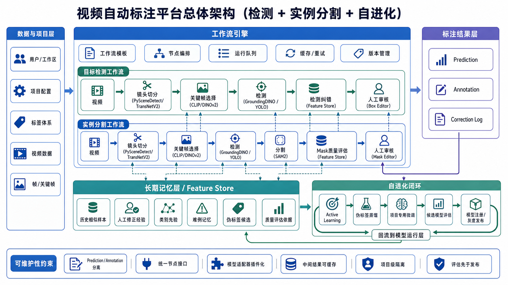
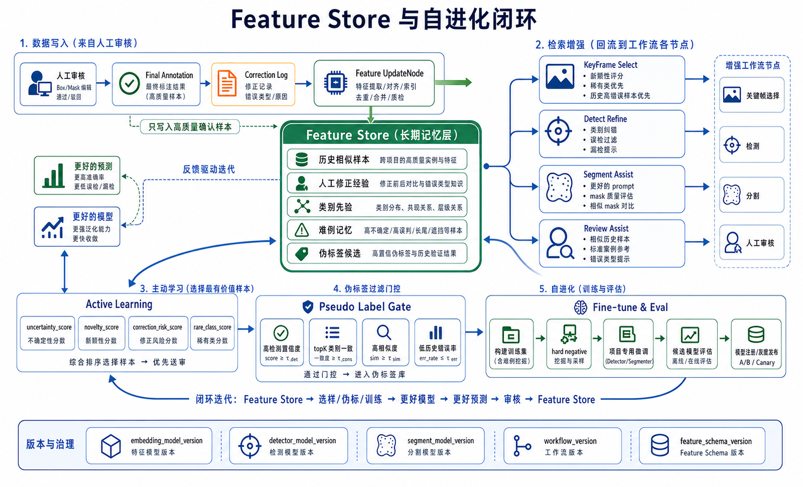

# autolabel

视频自动标注平台设计与原型项目。

## 当前可运行 Demo

当前仓库提供一个 SSH 隧道 + 浏览器 Web 界面的手工标注 demo。服务器负责视频存储、抽帧和后续模型推理，本地电脑只需要浏览器访问转发端口。

```text
视频/服务器路径
-> 服务器抽取候选帧
-> 浏览器手工标注矩形、多边形、圆形
-> 每帧 JSON + 项目 manifest
-> 下载 COCO JSON 或项目标注包
```

当前阶段先保留人工标注闭环，模型只用于关键帧筛选的候选能力；YOLO/SAM/DINO 等自动标注入口后续再接入。

### 服务器启动

在服务器 `mfl@111.0.130.56` 上进入项目目录：

```bash
cd /home/expand_disk/code_repository/mfl/yong_task/autolabel
```

当前服务器上已创建本项目专用 conda 环境：

```bash
source /home/panjunhao/miniconda3/etc/profile.d/conda.sh
conda activate /home/expand_disk/code_repository/mfl/yong_task/autolabel/.conda/autolabel
```

推荐用 `tmux` 在后台启动服务：

```bash
tmux new-session -d -s autolabel_web -c /home/expand_disk/code_repository/mfl/yong_task/autolabel \
  'source /home/panjunhao/miniconda3/etc/profile.d/conda.sh && \
   conda activate /home/expand_disk/code_repository/mfl/yong_task/autolabel/.conda/autolabel && \
   uvicorn autolabel_app.main:app --host 127.0.0.1 --port 42873 2>&1 | tee -a autolabel_web_42873.log'
```

如果会话已经存在，先停止旧服务：

```bash
tmux kill-session -t autolabel_web
```

检查服务是否启动：

```bash
ss -ltnp | grep 42873
curl http://127.0.0.1:42873/
```

查看日志：

```bash
tail -f /home/expand_disk/code_repository/mfl/yong_task/autolabel/autolabel_web_42873.log
```

### 其他电脑连接

其他电脑不直接访问服务器公网 HTTP 端口，而是在本地终端建立 SSH 隧道。

在需要使用标注界面的电脑上运行：

```bash
ssh -p 10022 -N -L 42873:127.0.0.1:42873 mfl@111.0.130.56
```

保持这个 SSH 窗口不要关闭，然后在这台电脑的浏览器访问：

```text
http://127.0.0.1:42873
```

如果本地电脑的 `42873` 已被占用，可以换成本地其他端口，例如：

```bash
ssh -p 10022 -N -L 43073:127.0.0.1:42873 mfl@111.0.130.56
```

对应浏览器访问：

```text
http://127.0.0.1:43073
```

说明：

- `-p 10022` 是 SSH 登录服务器的端口。
- `-L 本地端口:127.0.0.1:服务器服务端口` 表示把服务器上的标注服务映射到本地电脑。
- 标注服务只绑定服务器 `127.0.0.1`，外部用户必须通过 SSH 隧道访问。
- 视频、模型、项目数据都保存在服务器；本地电脑只负责浏览器交互。

### 当前标注能力

- 支持手动创建矩形、多边形、圆形标注。
- 支持项目命名，视频可上传，也可直接引用服务器路径。
- 支持 `A` / `S` 循环切换上一帧、下一帧，切换时自动保存当前帧。
- 支持 `Ctrl+F` 给当前对象选择或新增 label。
- 支持开启“AI 辅助标注”后用 `Ctrl+J` 精修当前对象、`Ctrl+K` 查找当前帧同类对象。
- 每个类别使用稳定颜色，同一视频内标签种类会自动汇总。
- 每张图一个 JSON，项目目录内同时保存 `manifest.json`、帧图、标注 JSON 和可下载导出包。

### 关键帧筛选

当前实现以人工标注为主，界面只保留一种默认抽帧策略：**平衡关键帧**。内部代号是 `segmentation_diverse`，含义不是“数据增强”，而是在效率和实例分割质量之间做折中：

```text
轻量帧差 / TransNetV2
-> 先筛出画面变化明显的候选帧
-> DINOv2 做视觉去重和多样性排序
-> YOLO26-seg 只在有限候选帧上估计小物体数量、尺度、拥挤度和边界复杂度
-> 选出差异大、重复少、适合实例分割标注的关键帧
```

SAM3.1 不参与抽帧主链路，避免因为重模型推理拖慢建项目流程。它只用于进入标注界面后的 AI 精修和同类候选查找。

如果模型文件不可用，系统会自动退回到轻量的帧差、间隔帧和图像统计。

### 目录约定

```text
autolabel_app/       FastAPI + 浏览器标注界面
configs/             模型目录清单和后续模型接入配置
docs/                设计文档
models/README.md     服务器本地模型说明，Git 只提交这份说明
data/projects/       项目数据、帧图片、每帧标注 JSON
data/downloads/      导出的标注包
assets/              README 和设计图资源
```

模型权重、tokenizer、第三方模型代码和本地 conda 环境只保存在服务器，不提交到 GitHub。模型目录说明见 [models/README.md](models/README.md)。

更详细设计见 [docs/mvp-demo-design.md](docs/mvp-demo-design.md) 和 [docs/keyframe-sampling-design.md](docs/keyframe-sampling-design.md)。



当前代码阶段范围收敛为：

- 输入数据为视频
- 标注任务优先支持目标分割场景下的人工精标
- 抽帧优先选择差异大、复杂度高、适合扩充数据集的关键帧
- 平台形态为：
  - SSH 隧道访问
  - 浏览器手工标注
  - 服务器保存项目数据
  - 后续接入模型辅助标注

本文档同时作为项目总览和长期架构设计说明；当前可运行能力以上面的 Demo 说明为准。

## 1. 目标

设计一个面向视频数据的半自动标注平台，优先解决以下问题：

- 视频逐帧人工标注成本高，完全手工不可持续
- 纯模型自动标注结果不稳定，需要人工复核闭环
- 视频检测和实例分割链路高度相似，但不应实现成两套系统
- 后续需要随着标注数据增加，不断提升自动标注效果

第一阶段定位：

- 跑通视频抽帧到人工标注的稳定闭环
- 支持目标分割项目需要的矩形、多边形、圆形标注
- 为后续 YOLO/SAM/DINO 等模型辅助能力保留稳定的数据结构和系统边界

## 2. 设计原则

### 2.1 两条工作流，共用一套底座

目标检测与实例分割的大部分流程相同：

- 视频导入
- 镜头切分
- 关键帧选择
- 自动预测
- 人工审核
- 导出数据

真正的差异只有：

- 检测工作流输出 `box`
- 分割工作流输出 `box + mask`

因此平台应该采用：

`共享视频处理底座 + 模板化工作流 + 不同审核编辑器`

### 2.2 Prediction 和 Annotation 必须分离

系统必须分开保存：

- `Prediction`：模型自动预测结果
- `Annotation`：人工最终确认结果
- `CorrectionLog`：人工相对模型做的修改

这决定后续是否能做：

- 错误分析
- 主动学习
- 特征库构建
- 伪标签蒸馏
- 增量训练
- 模型回滚

### 2.3 先检索增强，再增量训练

第一阶段不建议直接做复杂训练平台。

更稳的路径是：

1. 记录人工修正
2. 构建特征库
3. 实现相似实例召回和难例优先
4. 样本足够后再微调项目专用模型

### 2.4 工作流可扩展，但第一版不追求复杂低代码

第一阶段建议只做：

- 预置工作流模板
- 参数化执行
- 节点状态展示
- 中间结果缓存

不建议一开始就做：

- 完整拖拽式低代码画布
- 任意循环和复杂分支
- 在线训练编排平台

## 3. 业务范围

### 3.1 输入

- 单个视频文件
- 视频目录
- 项目级视频批次

### 3.2 输出

针对关键帧或传播后的帧，输出：

- 目标检测：
  - 类别
  - 边界框
  - 置信度

- 实例分割：
  - 类别
  - 边界框
  - mask 或 polygon
  - 置信度

### 3.3 用户操作

- 上传视频
- 配置项目标签体系
- 选择工作流模板
- 查看自动预测结果
- 人工确认、修改、删除、补标
- 导出训练集

## 4. 端到端主流程

```text
Video Upload
-> Scene Split
-> KeyFrame Select
-> Detect
-> Optional Segment
-> Human Review
-> Final Annotation
-> Correction Log
-> Feature Store
-> Export / Learn
```

### 4.1 目标检测工作流

```text
视频
-> 镜头切分
-> 关键帧选择
-> 检测模型
-> 人工审核(Box Editor)
-> 最终标注
```

### 4.2 实例分割工作流

```text
视频
-> 镜头切分
-> 关键帧选择
-> 检测模型
-> SAM2 分割
-> 人工审核(Mask Editor)
-> 最终标注
```

## 5. 系统架构

建议按六层组织。

### 5.1 项目与数据层

负责：

- 用户与工作区
- 项目
- 视频资源
- 抽帧结果
- 关键帧集合
- 标签体系
- 导出数据集

核心原则：

- 原始视频统一进入 `VideoAsset`
- 下游工作流统一消费 `Frame` 和 `KeyFrame`
- 不让模型节点直接依赖原始文件路径

### 5.2 工作流引擎层

负责：

- 工作流模板定义
- 节点编排
- 参数注入
- 任务队列
- 中间结果缓存
- 失败重试
- 工作流版本管理

第一阶段只需要支持：

- 线性步骤
- 可选步骤
- 运行日志

### 5.3 模型运行层

负责：

- 调用镜头切分模型
- 调用关键帧特征模型
- 调用检测模型
- 调用分割模型
- 调用检索索引

这一层必须做成节点适配器，而不是散落在业务控制器里的脚本调用。

### 5.4 标注结果层

负责：

- Prediction 存储
- Annotation 存储
- CorrectionLog 存储
- 审核状态管理
- 导出格式转换

### 5.5 自进化与学习闭环层

负责：

- Feature Store
- Active Learning
- 伪标签蒸馏
- 项目专用微调
- 候选模型评估
- 模型注册与灰度发布

### 5.6 前端工作台

负责：

- 项目与数据管理
- 工作流运行控制
- 审核画布
- 结果筛选和回查
- 进化状态展示

## 6. 工作流设计

### 6.1 工作流模板一：视频目标检测

```text
Video
-> Scene Split
-> KeyFrame Select
-> Detect
-> Review
-> Export
```

节点建议：

- `scene_detect`
- `keyframe_select`
- `detect`
- `human_review_detection`
- `export_detection`

### 6.2 工作流模板二：视频实例分割

```text
Video
-> Scene Split
-> KeyFrame Select
-> Detect
-> Segment
-> Review
-> Export
```

节点建议：

- `scene_detect`
- `keyframe_select`
- `detect`
- `segment`
- `human_review_segmentation`
- `export_segmentation`

### 6.3 Workflow Schema

```yaml
name: video_instance_segmentation_v1
task_type: instance_segmentation
version: 1

steps:
  - id: split
    type: scene_detect.transnetv2

  - id: keyframes
    type: keyframe.select
    depends_on: [split]
    params:
      max_per_shot: 3

  - id: detect
    type: detect.groundingdino
    depends_on: [keyframes]
    params:
      prompts: ["gear", "bolt", "shaft"]

  - id: segment
    type: segment.sam2
    depends_on: [detect]

  - id: review
    type: review.mask_editor
    depends_on: [segment]
```

## 7. 模型选型

第一阶段建议只接角色清晰、复用价值高的模型。

### 7.1 镜头切分

- `PySceneDetect`
  - 稳定、成熟、部署轻

- `TransNetV2`
  - 复杂转场更稳

### 7.2 关键帧特征

- `DINOv2`
  - 视觉特征、聚类、多样性选择

- `CLIP`
  - 语义检索、后续 prompt 相关召回

### 7.3 检测

- `GroundingDINO`
  - 开放词汇检测
  - 适合按标签词或 prompt 找目标

- `YOLO / YOLO-World`
  - 已知类别检测更快
  - 适合批量推理和项目专用微调

### 7.4 分割

- `SAM2`
  - 根据框或点生成实例 mask
  - 作为实例分割默认分割器

### 7.5 检索

- `FAISS`
  - 管理相似实例搜索
  - 用于一标多找、去重、难例采样

## 8. 自进化设计

第一阶段必须把自进化底座设计好，即使训练能力后置。

### 8.1 自进化目标

平台需要随着标注数据增加，持续提升：

- 检测召回率
- 检测精度
- mask 质量
- 人工审核效率
- 相似实例补全能力

### 8.2 自进化闭环

```text
Prediction
-> Human Correction
-> Correction Log
-> Feature Store
-> Active Learning
-> Pseudo Label / Distill
-> Fine-tune Candidate
-> Evaluation
-> Registry / Rollout
-> Back to Workflow
```

### 8.3 学习信号

系统至少要记录三类信号：

1. 接受
   - 模型预测正确或基本正确

2. 修正
   - 框位置变了
   - mask 边界改了
   - 类别改了

3. 补标或删除
   - 模型漏检
   - 模型误检

这些信号决定：

- 哪些样本进入特征库
- 哪些样本成为难例
- 哪些样本进入训练集

### 8.4 第一阶段的进化重点

建议顺序：

1. `CorrectionLog`
2. `Feature Store`
3. `Active Learning`
4. `Pseudo Label / Distillation`
5. `Fine-tuning`

### 8.5 维护规则

必须遵守：

- 新模型只作为候选版本，不直接覆盖线上
- 训练与发布必须版本化
- 评估不只看 mAP，也看人工审核效率
- Feature Store 和训练数据必须带：
  - `project_id`
  - `workflow_version`
  - `model_version`

### 8.6 Feature Store 的角色

Feature Store 不是检测模型、分割模型、关键帧模型的替代品，而是工作流里的长期记忆层。

它不直接负责发现目标或生成 mask，而是给前面的节点提供：

- 历史相似样本
- 人工修正经验
- 类别先验
- 难例记忆
- 伪标签候选
- 质量评估依据

在当前工作流里，它位于：

```text
Video Upload
-> Scene Split
-> KeyFrame Select
-> Detect
-> Optional Segment
-> Human Review
-> Final Annotation
-> Correction Log
-> Feature Store
-> Export / Learn
```

但它同时会反向增强前面的节点：

- `KeyFrame Select`
- `Detect`
- `Segment`
- `Review`
- `Learn`

因此 Feature Store 既是结果沉淀层，也是推理增强层。

### 8.7 Feature Store 驱动的增强工作流

建议把主链路细化为：

```text
视频输入
-> 抽帧 / 镜头切分
-> 关键帧选择
-> 检测模型 / 开放词汇检测模型
-> 分割模型
-> 特征提取器
-> 特征库检索
-> 预测结果融合
-> 人工审核
-> Correction Log
-> 特征库增量更新
-> 主动学习 / 伪标签 / 微调 / 模型评估
```

这里存在两个方向：

- 写入方向：人工审核后的高质量结果进入 Feature Store
- 读取方向：Feature Store 反过来辅助关键帧选择、检测纠错、分割质量判断、人工审核和学习闭环

### 8.8 Feature Store 如何辅助关键帧选择

关键帧选择不能只靠等间隔抽帧。

更合理的做法是：

1. 对候选帧提取 embedding
2. 在 Feature Store 中检索相似历史样本
3. 根据新颖性、稀有类、历史高错误区域重新计算优先级

推荐评分思路：

```text
frame_score =
  novelty_score
  + rare_class_score
  + historical_error_score
  + motion_change_score
```

含义：

- `novelty_score`：和已有样本差异越大，越值得选
- `rare_class_score`：疑似稀有类别，越值得选
- `historical_error_score`：类似样本过去经常被模型标错，越值得选
- `motion_change_score`：画面变化明显，越值得选

这样关键帧选择可以从“均匀抽帧”升级为：

- 挑新样本
- 挑难样本
- 挑模型不熟悉的样本
- 挑对训练更有价值的样本

### 8.9 Feature Store 如何辅助检测模型

检测模型负责产生候选框，例如：

- `YOLO`
- `YOLO-World`
- `GroundingDINO`

Feature Store 可以在检测后做三类增强。

第一类：类别纠错

- 检测模型给出候选框和类别
- 裁剪目标区域并提取 embedding
- 在 Feature Store 中查找 topK 相似实例
- 如果检测模型置信度低，但检索结果类别高度一致，则把该类别作为更强建议

第二类：误检过滤

- 某个框在正样本库里几乎找不到相似邻居
- 但和历史误检样本非常相似
- 则降低该框置信度，甚至直接降级为待人工重点审核

第三类：漏检补全

- 某些区域和历史目标实例高度相似
- 但检测模型没有产出 proposal
- 系统可以生成“疑似漏检”提示，送给人工审核

### 8.10 Feature Store 如何辅助分割模型

分割模型默认采用 `SAM2`。

Feature Store 可以从三个方向帮助分割。

第一，提供更好的 prompt

- 检测模型只给出 box
- Feature Store 可检索历史相似目标的中心点、前景点、背景点和典型形状
- 再将 `box prompt + point prompt + shape prior` 一起提供给 `SAM2`

第二，做 mask 质量评估

- 对生成后的 mask crop 提取 embedding
- 与同类高质量 mask 样本比较
- 如果相似度异常低，或面积、长宽比、轮廓复杂度异常，则提高人工审核优先级

第三，辅助视频内连续帧传播

- 上一帧人工确认的 mask 进入临时轨迹缓存或 Feature Store
- 当前帧通过相似检索找到相邻时刻的可靠实例
- 用于辅助当前帧分割或传播修正

### 8.11 Feature Store 如何辅助人工审核

这是最容易快速产生价值的地方。

审核工作台右侧建议显示：

- 当前模型预测
- 历史相似样本
- 历史人工最终标注
- 历史错误类型
- 同类标准样例
- 建议类别和置信提示

这样审核员不是从零判断，而是在历史案例支持下做确认或修正。

### 8.12 Feature Store 如何进入主动学习、伪标签和微调

Feature Store 不只服务审核，还直接参与自进化。

主动学习可综合四类信号：

```text
review_priority =
  0.4 * uncertainty_score
  + 0.3 * novelty_score
  + 0.2 * correction_risk_score
  + 0.1 * rare_class_score
```

含义：

- `uncertainty_score`：模型不确定
- `novelty_score`：特征库里缺少类似样本
- `correction_risk_score`：历史上类似样本经常被改
- `rare_class_score`：疑似稀有类别

伪标签不能只依赖模型置信度，建议增加特征库校验门：

```text
high-quality pseudo label if:
  detector_score high
  and retrieval_topk_consistency high
  and max_similarity high
  and class_error_rate low
```

训练集构建时，Feature Store 应支持导出：

- accepted samples
- corrected samples
- manual added samples
- hard negative samples
- high confidence pseudo labels

其中 `hard_negative_samples` 非常重要，它们通常比普通正样本更能减少误检。

### 8.13 Feature Store 的版本治理

Feature Store 必须记录版本信息，否则不同模型产生的向量会混在一起失真。

至少需要：

- `embedding_model_version`
- `detector_model_version`
- `segment_model_version`
- `workflow_version`
- `feature_schema_version`

如果后续从 `CLIP` 切到 `DINOv2` 新版本，或者从普通 crop 特征切到 masked crop 特征，应视为不同特征空间，不能直接混用。

### 8.14 Feature Service 形态

建议将 Feature Store 实现为独立的 `Feature Service`，而不是散落在工作流节点里的临时逻辑。

推荐接口：

- `POST /features/extract`
- `POST /features/upsert`
- `POST /features/search`
- `POST /features/mark-inactive`
- `GET /features/similar`
- `GET /features/stats`
- `POST /features/build-index`
- `POST /features/evaluate-index`

工作流中的其他节点通过接口调用它。

```text
Workflow Engine
  ├── SceneSplitNode
  ├── KeyFrameSelectNode
  │       └── FeatureService.novelty_score()
  ├── DetectNode
  ├── DetectionRefineNode
  │       └── FeatureService.search_similar()
  ├── SegmentNode
  ├── MaskQualityNode
  │       └── FeatureService.compare_mask_feature()
  ├── ReviewNode
  │       └── show similar examples
  ├── CorrectionLogNode
  ├── FeatureUpdateNode
  │       └── FeatureService.upsert()
  ├── ActiveLearningNode
  │       └── FeatureService.novelty/error stats
  └── ExportNode
```

### 8.15 MVP 落地顺序

推荐按五个阶段推进：

1. 审核辅助
   - 人工确认后裁剪 crop
   - 提取 `CLIP` 或 `DINOv2` embedding
   - 建立 `FAISS` 相似检索
   - 在审核页面展示相似历史样本

2. 主动学习
   - 将低置信预测、新颖样本、高错误类别排入人工优先审核队列

3. 预测纠错
   - 检测结果结合检索结果做类别重打分、误检过滤、漏检提示

4. 伪标签与训练集构建
   - 用高置信度、高一致性的候选自动进入伪标签池

5. 候选模型训练与评估
   - 从 `FeatureStore / Annotation / CorrectionLog` 构建训练集
   - 微调候选模型
   - 固定验证集评估
   - 灰度发布

### 8.16 Feature Store 详细图



## 9. 数据模型

### 9.1 Project

```text
id
workspace_id
name
description
task_type
label_schema_json
created_at
updated_at
```

### 9.2 VideoAsset

```text
id
project_id
uri
hash
duration_ms
fps
width
height
created_at
```

### 9.3 Frame

```text
id
video_id
frame_index
timestamp_ms
image_uri
is_keyframe
created_at
```

### 9.4 WorkflowRun

```text
id
project_id
workflow_name
workflow_version
status
params_json
started_at
finished_at
```

### 9.5 Prediction

```text
id
run_id
frame_id
category
bbox_json
mask_uri
score
model_name
model_version
raw_output_json
created_at
```

### 9.6 Annotation

```text
id
frame_id
prediction_id
category
bbox_json
mask_uri
source
annotator_id
status
created_at
updated_at
```

### 9.7 CorrectionLog

```text
id
prediction_id
annotation_id
change_type
before_json
after_json
user_id
created_at
```

### 9.8 FeatureItem

```text
id
project_id
frame_id
annotation_id
category
crop_uri
mask_uri
embedding_model_version
clip_embedding_uri
dinov2_embedding_uri
quality_score
hardness_score
novelty_score
model_version
workflow_version
feature_schema_version
created_at
```

### 9.9 FeatureVector

```text
id
feature_item_id
vector_type
dim
vector_uri
index_scope
created_at
```

## 10. API 与服务边界

即使第一版先做单体，也建议按服务边界组织代码：

- `auth`
- `projects`
- `datasets`
- `workflow`
- `inference`
- `annotations`
- `features`
- `exports`
- `models`

推荐 API：

- `POST /projects`
- `POST /projects/{id}/videos`
- `POST /projects/{id}/workflow-runs`
- `GET /workflow-runs/{id}`
- `GET /frames/{id}/predictions`
- `POST /annotations`
- `POST /corrections`
- `POST /exports`

## 11. 前端架构

第一阶段建议三个主页面。

### 11.1 项目页

展示：

- 视频数量
- 已抽帧数量
- 已完成工作流数量
- 待审核帧数量
- 当前模型版本

### 11.2 工作流运行页

能力：

- 选择视频批次
- 选择工作流模板
- 配置节点参数
- 运行工作流
- 查看每个节点状态

### 11.3 标注工作台

统一布局：

- 左侧：帧列表和筛选条件
- 中间：画布
- 右侧：实例列表、类别编辑、模型建议

审核器按任务切换：

- detection 使用 `Box Editor`
- segmentation 使用 `Mask Editor`

## 12. 可维护性要求

### 12.1 统一节点接口

```python
class WorkflowNode:
    name: str
    version: str

    def run(self, context: dict, inputs: dict, params: dict) -> dict:
        ...
```

### 12.2 模型适配器插件化

禁止在业务控制器里直接写模型调用。

建议适配器：

- `GroundingDINOAdapter`
- `YOLOAdapter`
- `SAM2Adapter`
- `DINOv2Adapter`
- `CLIPAdapter`
- `FAISSAdapter`

### 12.3 中间结果可缓存

必须支持缓存：

- 镜头切分结果
- 关键帧结果
- 检测 proposal
- 分割 mask
- embedding

### 12.4 项目级隔离

默认要求：

- 项目只能看到自己的视频、结果、特征和工作流运行记录
- 特征是否跨项目共享必须显式配置

### 12.5 评估先于发布

任何新模型上线前都必须完成：

- 固定验证集评估
- 与现网模型对比
- 人工审核效率对比

## 13. 推荐落地顺序

### 阶段 1：最小可用链路

- 视频导入
- 镜头切分
- 关键帧选择
- 检测工作流
- Box 审核
- 导出检测数据

### 阶段 2：接入实例分割

- 在检测结果上接 SAM2
- Mask 审核
- 导出分割数据

### 阶段 3：补齐学习闭环

- CorrectionLog
- Feature Store
- Active Learning
- 候选模型评估与注册

### 阶段 4：项目专用优化

- 检测器微调
- 相似实例检索
- 伪标签蒸馏

## 14. 技术栈建议

如果从零开始：

- 前端：React + TypeScript + Vite
- 后端：FastAPI + Python
- 数据库：PostgreSQL，MVP 可先用 SQLite
- 队列：Celery/RQ，MVP 可先用 BackgroundTasks
- 文件存储：本地目录，后续接 MinIO/S3
- 向量索引：FAISS

## 15. 结论

第一阶段不应该把系统做成“一个标注页面接几个模型”，而应该做成：

`视频数据层 + 模板化工作流引擎 + 检测/分割节点适配器 + 审核工作台 + 自进化闭环底座`

这样既能快速跑通视频目标检测与实例分割自动标注，也能为后续持续提升自动标注能力留下稳定演进路径。
